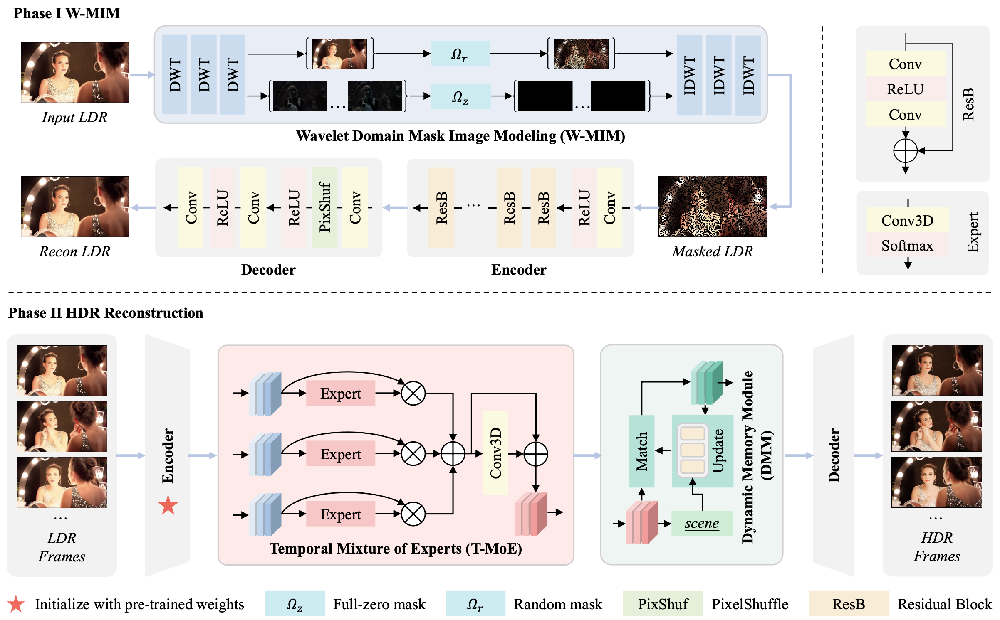

<div align="center">
  <h1>Wavelet-Domain Masked Image Modeling for Color-Consistent HDR Video Reconstruction</h1>
</div>

<h4 align="center"> 

Yang Zhang<sup>1</sup>,  [Zhangkai Ni](https://eezkni.github.io/)<sup>1</sup>, [Wenhan Yang](https://scholar.google.com/citations?user=S8nAnakAAAAJ&hl=en)<sup>2</sup>, [Hanli Wang](https://scholar.google.com/citations?user=WioFu64AAAAJ&hl=zh-CN)<sup>1</sup>

<sup>1</sup>Tongji University, <sup>2</sup>Pengcheng Laboratory

IEEE Transactions on Multimedia (TMM), 2026
</h4>


<!-- # Wavelet-Domain Masked Image Modeling for Color-Consistent HDR Video Reconstruction
#### IEEE Transactions on Multimedia (TMM), 2026

Yang Zhang<sup>1</sup>,  [Zhangkai Ni](https://eezkni.github.io/)<sup>1</sup>, [Wenhan Yang](https://flyywh.github.io/)<sup>2</sup>, [Hanli Wang](https://scholar.google.com/citations?user=WioFu64AAAAJ&hl=zh-CN)<sup>1</sup>

<sup>1</sup>Tongji University, <sup>2</sup>Pengcheng Laboratory -->

This repository provides the official implementation for the paper "Wavelet-Domain Masked Image Modeling for Color-Consistent HDR Video Reconstruction", IEEE Transactions on Multimedia (TMM), 2026. [Paper-official](https://ieeexplore.ieee.org/abstract/document/11557199/) | [Paper-arXiv](https://arxiv.org/abs/2602.07393)

<!-- [Paper-arXiv](https://arxiv.org/abs/2602.07393) -->





## About WMNet

High Dynamic Range (HDR) video reconstruction aims to recover fine brightness, color, and details from Low Dynamic Range (LDR) videos. However, existing methods often suffer from color inaccuracies and temporal inconsistencies. To address these challenges, we propose WMNet, a novel HDR video reconstruction network that leverages Wavelet domain Masked Image Modeling (W-MIM). WMNet adopts a two-phase training strategy: In Phase I, W-MIM performs self-reconstruction pre-training by selectively masking color and detail information in the wavelet domain, enabling the network to develop robust color restoration capabilities. A curriculum learning scheme further refines the reconstruction process. Phase II fine-tunes the model using the pre-trained weights to improve the final reconstruction quality. To improve temporal consistency, we introduce the Temporal Mixture of Experts (T-MoE) module and the Dynamic Memory Module (DMM). T-MoE adaptively fuses adjacent frames to reduce flickering artifacts, while DMM captures long-range dependencies, ensuring smooth motion and preservation of fine details. Additionally, since existing HDR video datasets lack scene-based segmentation, we reorganize HDRTV4K into HDRTV4K-Scene, establishing a new benchmark for HDR video reconstruction. Extensive experiments demonstrate that WMNet achieves state-of-the-art performance across multiple evaluation metrics, significantly improving color fidelity, temporal coherence, and perceptual quality.

**TL;DR:** We propose WMNet, a novel HDR video reconstruction network that leverages Wavelet domain Masked Image Modeling (W-MIM) with a two-phase training strategy to address color inaccuracies and temporal inconsistencies. It decouples reconstruction into robust color/detail restoration via wavelet-domain masking and temporal coherence enhancement through Temporal Mixture of Experts (T-MoE) and Dynamic Memory Module (DMM).


## Experimental Results

Performance comparison of various HDR reconstruction models on HDRTV4K-Scene and HDRTV4K-LongScene. The performance on metrics PSNR, SSIM, SR-SIM, $\Delta E_{ITP}$, HDR-VDP3, LPIPS and $E_{warp}$ are reported. The top three performances are highlighted in red, orange, and yellow backgrounds, respectively.


### Quantitative comparisons on HDRTV4K-Scene dataset
<div align="center">  </div>

### Quantitative comparisons on HDRTV4K-LongScene dataset
<div align="center">  </div>


## Environment setup
To start, we prefer creating the environment using conda:
```sh
conda create -n wmnet
conda activate wmnet
pip install -r requirements.txt
```

[PyTorch](https://pytorch.org/) installation is machine dependent, please install the correct version for your machine.

<details>
  <summary> Dependencies (click to expand) </summary>

  - `PyTorch`, `numpy`: main computation.
  - `pytorch-msssim`: SSIM calculation.
  - `tqdm`: progress bar.
  - `opencv-python`,`scikit-image`: image processing.
  - `imageio`: images I/O.
  - `einops`: torch tensor shaping with pretty api.
</details>


## Getting the data

The datasets we used are as follows:

- [HDRTV4K-Scene](https://github.com/AndreGuo/HDRTVDM)
- [HDRTV4K-LongScene](https://github.com/chxy95/HDRTVNet/blob/main/video_links.txt)

Please organize the dataset structure in accordance with Section 4.A.1 of the paper.

## Directory structure for the datasets

<details>
  <summary> Dataset Structure (click to expand) </summary>

    data_path
    ├── HDRTV4KSence
    │   ├── train_scene_hdr
    │   │   ├── abp1_autumnwoods
    │   |   |   ├── 000.png
    │   |   |   ├── 001.png
    │   |   |   ├── 002.png
    │   |   |   ...
    │   |   |   └── 009.png
    │   |   ├── abp1_bamboo
    │   |   ...
    │   |   └── ugc2_sunroom
    │   ├── train_scene_sdr
    │   │   ├── abp1_autumnwoods
    │   |   |   ├── 000.png
    │   |   |   ├── 001.png
    │   |   |   ├── 002.png
    │   |   |   ...
    │   |   |   └── 009.png
    │   |   ├── abp1_bamboo
    │   |   ...
    │   |   └── ugc2_sunroom
    │   ├── test_scene_hdr
    │   │   ├── abp1_dancinggirl
    │   |   |   ├── 000.png
    │   |   |   ├── 001.png
    │   |   |   ├── 002.png
    │   |   |   ...
    │   |   |   └── 009.png
    │   |   ├── abp1_factoryout1
    │   |   ...
    │   |   └── ugc2_sculpture
    │   └── test_scene_sdr
    │       ├── abp1_dancinggirl
    │       |   ├── 000.png
    │       |   ├── 001.png
    │       |   ├── 002.png
    │       |   ...
    │       |   └── 009.png
    │       ├── abp1_factoryout1
    │       ...
    │       └── ugc2_sculpture
    └── HDRTV4KLong
        ├── test_video_scene_hdr
        │   ├── scene01
        |   |   ├── 01.png
        |   |   ├── 02.png
        |   |   ├── 03.png
        |   |   ...
        |   |   └── 30.png
        |   ├── scene02
        |   ...
        |   └── scene10
        └── test_video_scene_sdr
            ├── scene01
            |   ├── 01.png
            |   ├── 02.png
            |   ├── 03.png
            |   ...
            |   └── 30.png
            ├── scene02
            ...
            └── scene10

</details>


## Running the model
### Preprocess
1. Prepare the training dataset.
2. Preprocess the `train_scene_hdr` and `train_scene_sdr` by running the following command respectively:
```bash
python3 preprocessing.py --input_folder [INPUT_FOLDER] --save_folder [SAVE_FOLDER] --n_thread [YOUR_THREAD_COUNT] --crop_sz 128 --step 128 --thres_sz 0 --compression_level 95
```

Please note that preprocessing is required ONLY for the training dataset; the testing dataset DOES NOT require preprocessing.

### Training
The training of WMNet contains two stages.

#### Stage 1 training
1. Change working dir into `stage1` by ```cd stage1```.
2. Modify `'train.dataroot_LQ'` and `'train.dataroot_GT'` in the `options/train/fmnet_final.yml` with the preprocessed training dataset.
3. Modify `'val.dataroot_LQ'` and `'val.dataroot_GT'` in the `options/train/fmnet_final.yml` with the testing dataset.
4. Run the following commands for training:
```bash
python3 train.py -opt options/train/fmnet_final.yml
```

#### Stage 2 training
1. Change working dir into `stage2` by ```cd stage2```.
2. Modify `'train.dataroot_LQ'` and `'train.dataroot_GT'` in the `options/train/fmnet_final.yml` with the preprocessed training dataset.
3. Modify `'val.dataroot_LQ'` and `'val.dataroot_GT'` in the `options/train/fmnet_final.yml` with the testing dataset.
4. Modify `'path.pretrain_model_G'` in the `options/train/fmnet_final.yml` with the last saved checkpoint in stage 1.
5. Run the following commands for training:
```bash
python3 train.py -opt options/train/fmnet_final.yml
```

### Testing
1. Prepare the testing dataset.
2. Change working dir into `stage1` or `stage2`.
3. Modify `'val.dataroot_LQ'` and `'val.dataroot_GT'` in the `options/train/fmnet_final.yml` with the testing dataset.
4. Run the following commands for testing:
```bash
python3 train_val.py -opt options/train/fmnet_final.yml
```


## Results
Pretrained models can be find in the `./pretrain_model` folder.

<!-- ## Citation
If you find our work useful, please cite it as
```
@article{ni2025ssiu,
  title={Structural Similarity-Inspired Unfolding for Lightweight Image Super-Resolution},
	author={Ni, Zhangkai, and Zhang, Yang, and Yang, Wenhan, and Wang, Hanli, and Wang, Shiqi and Kwong, Sam},
	journal={IEEE Transactions on Image Processing},
	volume={},
	pages={},
	year={2025},
	publisher={IEEE}
}
``` -->


## Contact
Thanks for your attention! If you have any suggestion or question, feel free to leave a message here or contact Dr. Zhangkai Ni (eezkni@gmail.com).


## License
[MIT License](https://opensource.org/licenses/MIT)
